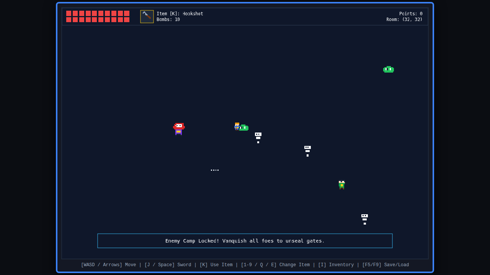
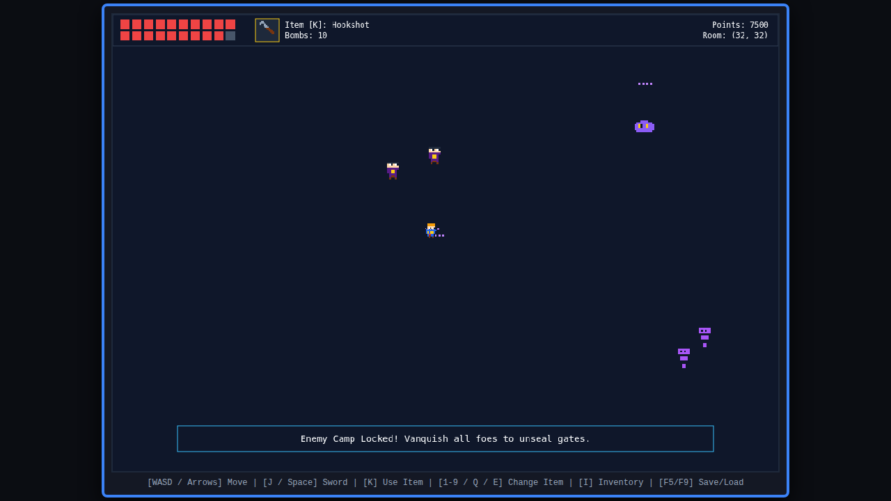
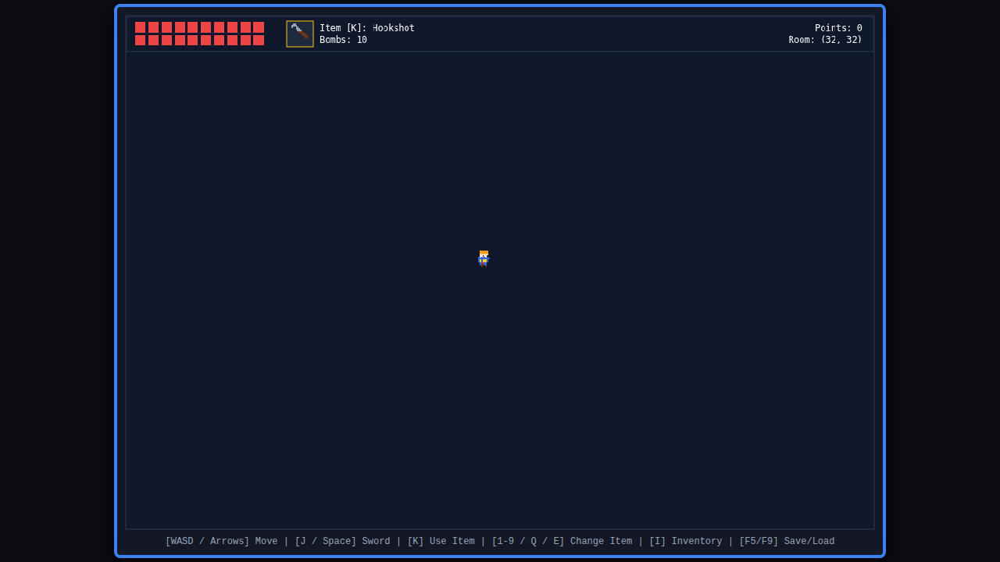
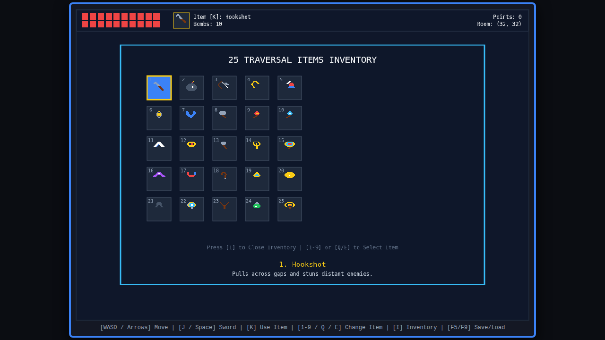
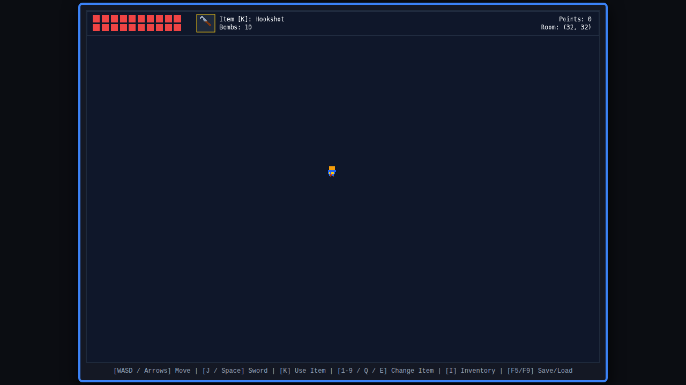

# Feral to Kings - Top-Down SNES Adventure Game

A retro top-down adventure web game inspired by *The Legend of Zelda: A Link to the Past* for the SNES. Built with **TypeScript**, **HTML5 Canvas**, and **Vite**.

---

## 🌐 Live Web Game (GitHub Pages & Local)

The game is deployed and ready to play publicly:
👉 **Live Public Site:** [https://claudiogonzalo.github.io/feral-to-kings/](https://claudiogonzalo.github.io/feral-to-kings/)
👉 **Local Development:** `http://localhost:5173`

---

## 👾 Enemy Bestiary & Tier Scaling Gallery

### 1. Base Enemy Camp (Slimes, Skeletons, Archers & Dungeon Boss)

### 2. Tier 3 Shadow Enemy Scaling (>5,000 Points Showcase)

---

## 🖼️ Game Renders & Scenes

### 1. Game Start (Sanctuary at Room 32, 32)

### 2. 25-Item Inventory Overlay Menu

### 3. Combat & Enemy Camp Room

### 4. Overworld Ruins & Ancient Lore Signs

---

## 🎮 Controls

| Action | Key Binding |
| :--- | :--- |
| **Move Hero** | `W` / `A` / `S` / `D` or `Arrow Keys` |
| **Attack (Astral Blade)** | `J` or `Spacebar` |
| **Use Selected Item** | `K` |
| **Open / Close Inventory** | `I` |
| **Quick Select Item** | `1` - `9` |
| **Previous / Next Item** | `Q` / `E` |
| **Quick Save State** | `F5` |
| **Quick Load State** | `F9` |

---

## ✨ Features

* **GitHub Actions CI/CD**: Automatic deployment to GitHub Pages via `.github/workflows/deploy.yml`.
* **32x22 Tile Resolution**: Double SNES resolution (1024x704px canvas) rendered with crisp pixelated smoothing disabled.
* **64x64 Procedural World Grid**: 4,096 interconnected rooms featuring Starting Sanctuary, Enemy Camps, Relic Chambers, and Fallen Kingdom Ruins.
* **20 Hearts & Best Gear**: Hero starts with 20 maximum hearts, Astral Blade (50 damage), and Golden Armor (50% damage reduction).
* **25 Traversal & Combat Items**: All 25 functional items available from the start in a 5x5 interactive overlay inventory menu (Hookshot, Bombs, Bow, Boomerang, Pegasus Boots, Lantern, Flippers, Megaton Hammer, Fire Wand, Ice Rod, Roc Feather, Power Bracelet, Shovel, Warp Flute, Lens of Truth, Invisibility Cape, Magnetic Glove, Grappling Whip, Gust Jar, Thunder Medallion, Quake Boots, Ether Mirror, Trick Slingshot, Elixir Flask, Relic Radar).
* **Enemy Camp Door Locking**: Entering an uncleared enemy camp seals all doors until every foe is vanquished, rewarding bomb credits and score points.
* **Point-Based Enemy Scaling**: Defeating enemies, clearing camps, finding relics, and reading lore signs increases your score. Past **5,000 points**, enemy difficulty scales every 1,000 points into higher tiers with upgraded HP, speed, damage, and visual palette swaps (Green -> Red -> Shadow Purple).
* **Fallen Kingdom Lore Signs**: Ancient stone signs scatter the overworld detailing the history of the fallen kingdom.
* **Save State System**: Instant LocalStorage slot quick save and quick load (`F5` / `F9`).
